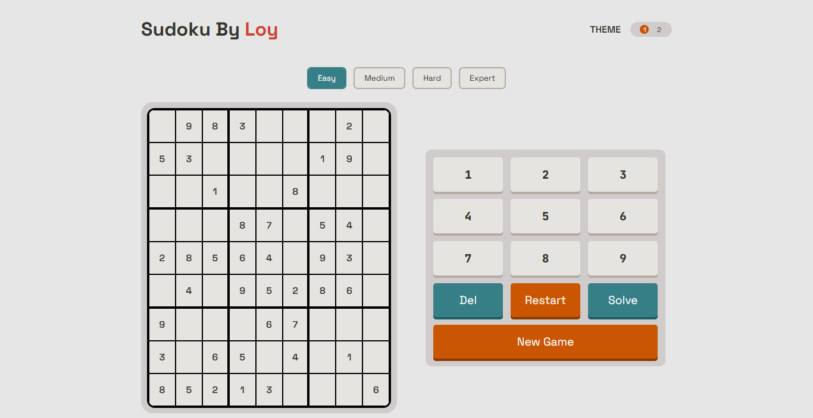
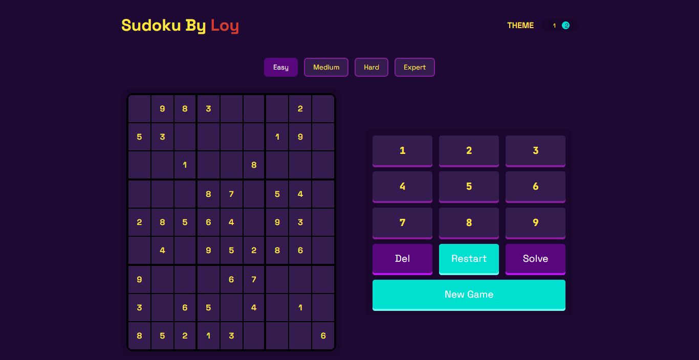

# Sodoku By Loy

A Sudoku game built with React and Vite, featuring a hand-written backtracking
solver (with an animated solve step-through), a unique-solution puzzle
generator with four difficulty levels, conflict/relative cell highlighting,
light/dark theming, and progress persistence via `localStorage`.

The main goal of this project wasn't just to ship a playable Sudoku game —
it was to actually implement backtracking myself, understand _why_ it works,
and then measure how much smarter search ordering (MRV) speeds it up. That's
the part of this README worth reading closely.

<p align="center">
  
  &nbsp;&nbsp;
  
</p>

---

## Table of Contents

- [Project Structure](#project-structure)
- [Tech Stack](#tech-stack)
- [Features](#features)
- [The Backtracking Algorithm](#the-backtracking-algorithm)
  - [The Three Keys: Choice, Constraint, Goal](#the-three-keys-choice-constraint-goal)
  - [The Naive Solver, Line by Line](#the-naive-solver-line-by-line)
  - [How the Recursion Actually Executes](#how-the-recursion-actually-executes)
  - [Visualizing the Search Tree](#visualizing-the-search-tree)
- [Smarter Backtracking: MRV](#smarter-backtracking-mrv)
  - [Why Picking the Right Cell Matters](#why-picking-the-right-cell-matters)
  - [Benchmarks: Naive vs. MRV](#benchmarks-naive-vs-mrv)
- [The Puzzle Generator](#the-puzzle-generator)
- [The `useGameLogic` Custom Hook](#the-usegamelogic-custom-hook)
- [Known Issues / Things I'm Still Working On](#known-issues--things-im-still-working-on)
- [Running Locally](#running-locally)

---

## Project Structure

```
soduku/
├── index.html
├── package.json
├── vite.config.js
├── docs/
│   ├── screenshots/            # light-theme.png, dark-theme.png (used above)
│   └── diagrams/                # search-tree.svg (used below)
├── public/
│   ├── favicon.svg
│   ├── icons.svg
│   └── fonts/                   # Space Grotesk + JetBrains Mono (self-hosted)
└── src/
    ├── main.jsx                 # React root, wraps App in ThemeProvider
    ├── App.jsx                  # Top-level layout, wires useGameLogic + useTheme together
    ├── App.css
    ├── index.css                 # CSS custom properties (theme tokens), font-face rules
    ├── board.js                  # legacy/scratch board data, unused by the app
    ├── utilities.js              # pure game logic: validation, solver, generator
    ├── context/
    │   └── Context.js            # ThemeContext (createContext)
    ├── components/
    │   ├── ContextProviders/
    │   │   └── ThemeProvider.jsx # holds theme state, provides it via ThemeContext
    │   ├── cell/
    │   │   ├── cell.jsx
    │   │   └── cell.module.css
    │   └── NumPad/
    │       ├── NumPad.jsx
    │       └── NumPad.module.css
    └── hooks/
        ├── useGameLogic.js       # all board/game state + derived logic (see below)
        └── useTheme.js           # thin hook around ThemeContext
```

## Tech Stack

- **React 19** + **Vite** for the app shell and dev/build tooling
- **Plain CSS Modules** per component, plus a global token sheet
  (`index.css`) driving both themes through CSS custom properties
- **`clsx`** for conditional class composition
- **`localStorage`** for persisting the in-progress board and play mode
  across reloads
- No external Sudoku or solver library — the board validation, solver, and
  generator in `utilities.js` are all hand-written

## Features

- 9×9 interactive board with row / column / box highlighting for the active
  cell, and highlighting of every other cell sharing the active cell's value
- Live conflict detection — an illegal move is flagged in red immediately,
  without blocking input
- Four difficulty levels (Easy, Medium, Hard, Expert), each generating a
  puzzle with a **guaranteed unique solution**
- An animated **Solve** button that visibly steps through the backtracking
  search, cell by cell, rather than just dumping the answer on screen
- Restart (back to the puzzle's starting state) and New Game (regenerate)
- Light/dark theme toggle, persisted via `data-theme` on `<body>`
- Board state and play mode persisted to `localStorage`

---

## The Backtracking Algorithm

The single biggest thing I took away from this project was actually
understanding backtracking, not just using it. I found it easiest to reason
about it through **three questions**, which are the Three Keys:
**Choice, Constraint, Goal.**

### The Three Keys: Choice, Constraint, Goal

I think of backtracking as a _smarter brute force_ — instead of blindly
generating every possible arrangement of numbers and checking each one at
the end, it checks as it goes, and abandons a path the moment that path
becomes impossible. The three keys are the three questions you need to
answer to turn "brute force" into "backtracking":

- **Choice** — _what am I deciding at this step, and how do I try the
  options?_ This is what a single recursive call represents: "at this one
  empty cell, try each candidate digit." Recursion is what lets you express
  "make a choice, then treat the rest of the problem as a smaller copy of
  itself."
- **Constraint** — _when do I stop going down a path, and when do I not
  even step onto it in the first place?_ This is the Sudoku rule check
  (no repeat in row/column/box). It answers two slightly different
  questions: _before_ placing a digit, "is this choice even legal?" (skip
  it, don't recurse); and, after recursing, _"did every path from this
  choice fail?"_ (undo the choice, report failure upward).
- **Goal** — _what am I actually trying to reach?_ For the solver, the goal
  is simply "no empty cells remain." Every recursive call's first job is to
  check whether the goal is already satisfied before making any more
  choices.

Every backtracking function I wrote in this project — the solver, the
MRV solver, and the puzzle generator's uniqueness checker — is structured
around answering these same three questions.

### The Naive Solver, Line by Line

This is the solver that **doesn't** use MRV — it just finds the first empty
cell it sees (scanning left-to-right, top-to-bottom) and works from there.
I kept it in the codebase specifically because comparing it against the MRV
version is what taught me _why_ cell ordering matters (see
[Benchmarks](#benchmarks-naive-vs-mrv)).

From [`src/hooks/useGameLogic.js`](src/hooks/useGameLogic.js):

```js
async function solver(board, updateBoard) {
  recursiveCounts.current++;
  const emptyCell = findFirstEmptyCell(board);

  if (!emptyCell) {
    return board; // GOAL: no empty cells left
  }

  const { row, col } = emptyCell;
  setCurrentSolverCell(`${row}-${col}`);

  for (let num = 1; num <= 9; num++) {
    // CHOICE: try each digit
    if (isMoveValid(board, [row, col], num).moveIsValid) {
      // CONSTRAINT (pre-check)
      let newBoard = modifyCell(board, [row, col], num);

      updateBoard(newBoard);
      await pause(solverSpeed.current);

      let solvedBoard = await solver(newBoard, updateBoard); // recurse

      if (solvedBoard) {
        return solvedBoard; // a full path to the goal was found
      }

      // CONSTRAINT (post-check): this digit led nowhere — undo it
      setCurrentSolverCell(`${row}-${col}`);
      const undoneBoard = modifyCell(board, [row, col], 0);
      updateBoard(undoneBoard);
      await pause(solverSpeed.current);
    }
  }

  return null; // every digit failed — dead end, backtrack
}
```

Mapped onto the three keys:

| Key        | Where it happens in `solver()`                                                                                                                                                            |
| ---------- | ----------------------------------------------------------------------------------------------------------------------------------------------------------------------------------------- |
| Choice     | `for (let num = 1; num <= 9; num++)` — each iteration is one choice, and the recursive call `solver(newBoard, ...)` treats the rest of the board as a smaller version of the same problem |
| Constraint | `isMoveValid(...)` before placing (don't even try an illegal digit), and `if (solvedBoard)` / the undo block after recursing (if nothing below this choice worked, take it back)          |
| Goal       | `if (!emptyCell) return board;` — the very first check in every call                                                                                                                      |

`findFirstEmptyCell` (in [`src/utilities.js`](src/utilities.js)) is
deliberately simple — it scans rows top-to-bottom and returns the first
cell containing `0`. It has no opinion about which empty cell is
_strategically_ the best one to fill next, which is exactly the naive
choice-ordering that MRV improves on.

### How the Recursion Actually Executes

Each call to `solver()` pushes a new frame onto the JS call stack, and that
frame's local variables (`board`, `emptyCell`, the current `num` in its
`for` loop) stay alive for as long as that frame is on the stack — including
while it's waiting on a deeper recursive call to return.

Walking through what the stack looks like for the first few cells:

```
solver(board)                     // call #1 — cell (0,0), num = 1 valid, recurse
 └─ solver(board with 1@0,0)      // call #2 — cell (0,1), num = 1 conflicts, num = 2 valid, recurse
     └─ solver(board with 1,2)    // call #3 — cell (0,2), tries 1..9, ALL fail
                                   //           → return null, frame #3 pops
     ↑ back in call #2: solvedBoard is null → undo (0,1)=2, try num = 3 ...
```

When a call reaches a **dead end** — every digit 1–9 either conflicts or
leads to a deeper `null` — it `return`s `null` and its stack frame is
popped. Control resumes in the _parent_ frame exactly where it left off:
inside its `for` loop, right after the recursive call. That parent then
undoes its own most recent placement (`modifyCell(board, [row, col], 0)`)
and moves on to the next candidate digit. This is backtracking, made
literal by the call stack itself — "backtrack" isn't a separate mechanism,
it's just what naturally happens when a recursive call returns `null` and
its caller resumes its loop.

If a call finds a digit whose recursive call _does_ return a solved board
(non-null), it immediately `return`s that board too — no more digits are
tried at that level — and that propagates all the way back up to call #1.

---

## Smarter Backtracking: MRV

### Why Picking the Right Cell Matters

The naive solver always picks the _first_ empty cell it encounters. MRV
("Minimum Remaining Values," a standard constraint-satisfaction heuristic)
instead scans **every** empty cell, counts how many digits are still legal
for each one, and picks the cell with the **fewest legal options**:

From [`src/utilities.js`](src/utilities.js):

```js
export function findBestEmptyCell(board) {
  let bestCell = null;
  let bestMoves = null;

  for (let row = 0; row < 9; row++) {
    for (let col = 0; col < 9; col++) {
      if (board[row][col] !== 0) continue;

      const moves = allPossibleMoves(board, [row, col]);

      if (moves.length === 0) {
        return { cell: [row, col], moves: [] }; // instant dead end — fail fast
      }

      if (bestMoves === null || moves.length < bestMoves.length) {
        bestCell = [row, col];
        bestMoves = moves;
      }
    }
  }

  return { cell: bestCell, moves: bestMoves };
}
```

And the solver built on top of it, `solverMRV` in
[`src/hooks/useGameLogic.js`](src/hooks/useGameLogic.js), is structurally
identical to the naive `solver()` — same three keys, same recursion, same
undo-on-failure — it just swaps `findFirstEmptyCell` for
`findBestEmptyCell`, and only loops over `moves` (the digits already known
to be legal) instead of blindly testing `1..9`.

The intuition for _why_ this is faster: a cell with only 1 or 2 legal
digits left is close to being forced — committing to it either fails fast
(cheap: you find out quickly and backtrack immediately) or narrows the rest
of the board a lot (useful: the next cell you look at is now more
constrained too). A cell with 6–7 options left, chosen arbitrarily, opens
up a much wider branch of the search tree before you find out whether that
branch was ever going to work. MRV keeps the tree narrow near the top,
where a bad decision is most expensive.

### Benchmarks: Naive vs. MRV

I timed both solvers on Expert-difficulty boards (the hardest the generator
produces) and logged `recursiveCounts.current` — incremented once per
function call, in both `solver()` and `solverMRV()` — as a second,
implementation-independent measure of search effort:

**Wall-clock time, Expert difficulty**

| Solver            | Fastest           | Slowest     |
| ----------------- | ----------------- | ----------- |
| Naive (`solver`)  | up to ~30 minutes | —           |
| MRV (`solverMRV`) | ~4 seconds        | ~33 seconds |

**Recursive call count** (three runs per difficulty, naive vs. MRV side by side)

| Difficulty | Naive calls            | MRV calls |
| ---------- | ---------------------- | --------- |
| Easy       | 405                    | 69        |
| Easy       | 2,263                  | 49        |
| Easy       | 203                    | 49        |
| Medium     | 641                    | 53        |
| Medium     | 209                    | 53        |
| Medium     | 601                    | 64        |
| Hard       | _(too slow to finish)_ | 169       |
| Hard       | _(too slow to finish)_ | 291       |
| Hard       | _(too slow to finish)_ | 1,180     |

Even on Easy boards, where both solvers finish quickly, MRV still needs
roughly **4–45× fewer recursive calls** to reach the same answer — the gap
just isn't visible on the clock yet because the boards are small enough
either way. On Hard boards the naive solver's search tree grows large
enough that it stops being practical to even finish a timed run, while MRV
stays in the low hundreds to low thousands of calls. This is the same
"prune the tree early" idea as the Constraint key above — MRV doesn't
change _what_ counts as a valid move, it changes _which cell you ask first_,
so bad branches get discovered (and abandoned) sooner.

---

## The Puzzle Generator

`generatePuzzle(level)` in [`src/utilities.js`](src/utilities.js) builds a
puzzle in two backtracking phases:

**1. Fill an empty board.**

```js
const board = filledBoard(emptyBoard);
```

`filledBoard` is a backtracking function structured exactly like the naive
solver, except at each empty cell it **shuffles** the candidate digits
before trying them (`shuffle([1..9])`), so the same empty starting grid
produces a different completed board every time.

**2. Dig holes while preserving a unique solution.**

```js
while (emptyCells < targetEmptyCells && visited.size < 81) {
  const row = Math.floor(Math.random() * 9);
  const col = Math.floor(Math.random() * 9);
  const cellKey = `${row}-${col}`;

  if (board[row][col] === 0 || visited.has(cellKey)) {
    continue; // guardrail: skip already-empty / already-tried cells
  }

  const originalValue = board[row][col];
  board[row][col] = 0;

  const solutions = countSolutions(board);

  if (solutions === 1) {
    emptyCells++; // still unique — keep it empty
  } else if (solutions >= 2) {
    board[row][col] = originalValue; // ambiguous — put it back
  }
  visited.add(cellKey);
}
```

The loop picks a random cell, guards against re-visiting a cell that's
already empty or already tested (`board[row][col] === 0 || visited.has(...)`),
temporarily clears it, and asks `countSolutions` whether the board **still
has exactly one solution**. If yes, the cell stays empty and counts toward
`emptyCells`. If removing it would make the puzzle solvable more than one
way, the original digit goes back in and that cell is marked visited so it
isn't retried. This repeats until the difficulty's target number of empty
cells is hit, or every cell has been visited once:

```js
if (level === "easy") targetEmptyCells = randomValue(36, 45);
if (level === "medium") targetEmptyCells = randomValue(46, 49);
if (level === "hard") targetEmptyCells = randomValue(50, 54);
if (level === "expert") targetEmptyCells = randomValue(55, 59);
```

So difficulty is entirely a function of **how sparse** the final board is
allowed to get while a unique solution is still provable.

`countSolutions` is itself a backtracking function (same three keys again —
choice: try each digit; constraint: skip illegal digits; goal: an empty
board means "found one more solution") with one shortcut: it stops the
instant it finds a **second** solution, since at that point uniqueness is
already disproven and continuing to search would be wasted work.

**Why Expert generation is slow, and where the browser lag comes from:**
Expert boards remove 55–59 of the 81 starting digits — the board ends up
roughly 70% empty. `countSolutions` uses the same naive, first-empty-cell
search order as `solver()` (not the MRV cell-picking from
`findBestEmptyCell`), and it gets called up to 81 times per generated
puzzle — once for nearly every cell the digging loop tries. A near-empty
board is a much bigger search space for a naive-ordered backtracker to
prove uniqueness over, and none of those `countSolutions` calls yield
control back to the browser while they run, so the whole digging phase
executes as one long, blocking chunk of JavaScript — which is exactly what
the browser's "page is slowing down" warning is reacting to. Reusing MRV
ordering inside `countSolutions`, and/or moving generation off the main
thread (a Web Worker, or yielding between digs), are the two changes that
would address this directly.

---

## The `useGameLogic` Custom Hook

All board state — the grid, the active cell, conflict/wrong-move tracking,
the solver's current cell, play mode — lives in one custom hook,
[`useGameLogic`](src/hooks/useGameLogic.js), which `App.jsx` calls once and
passes down as props to `Cell` and `NumPad`. This was new territory for me:
previously I'd have reached for prop-drilled `useState` calls scattered
across a component, or jumped straight to a Context.

The pattern this hook follows is what I've since learned is often called a
**"logic hook"** — a plain hook that owns a slice of state plus every
function that operates on it, called from a single place, with the results
handed down as props. It's a step up from stuffing all of that directly
into `App.jsx`, without reaching for the heavier tooling (`useReducer`,
Context, or a state library) that this particular project doesn't need yet:

- Every consumer of this state (`Cell`, `NumPad`) is a direct child of
  `App`, one prop-passing hop away — there's no deeply nested component
  that would need Context to avoid drilling.
- Theme, by contrast, genuinely _is_ global (it's read via a `data-theme`
  attribute on `<body>` and could reasonably be read by any component,
  anywhere) — which is why `ThemeProvider` + `ThemeContext` +
  [`useTheme`](src/hooks/useTheme.js) uses Context, while the game state
  doesn't.

If a future feature needed board state from somewhere that _isn't_ a
descendant of `App` (a separate stats panel mounted elsewhere in the tree,
for instance), that would be the point where promoting this into a Context
— or a reducer, given how many related `useState` calls already live here —
would start to pay for itself.

---

## Running Locally

```bash
npm install
npm run dev
```

Build for production:

```bash
npm run build
npm run preview
```
